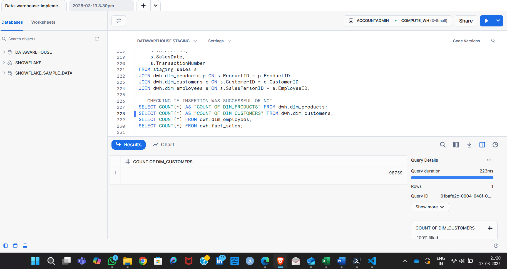
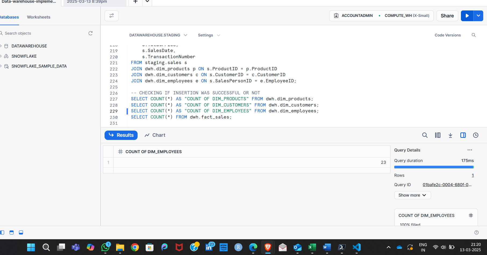
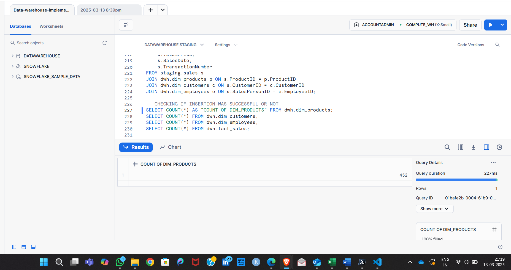
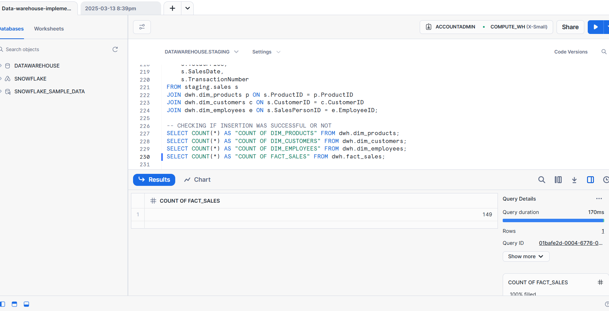
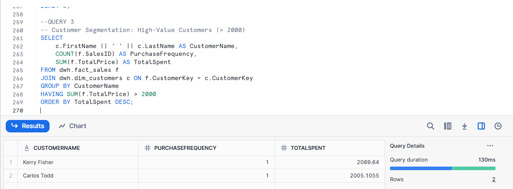
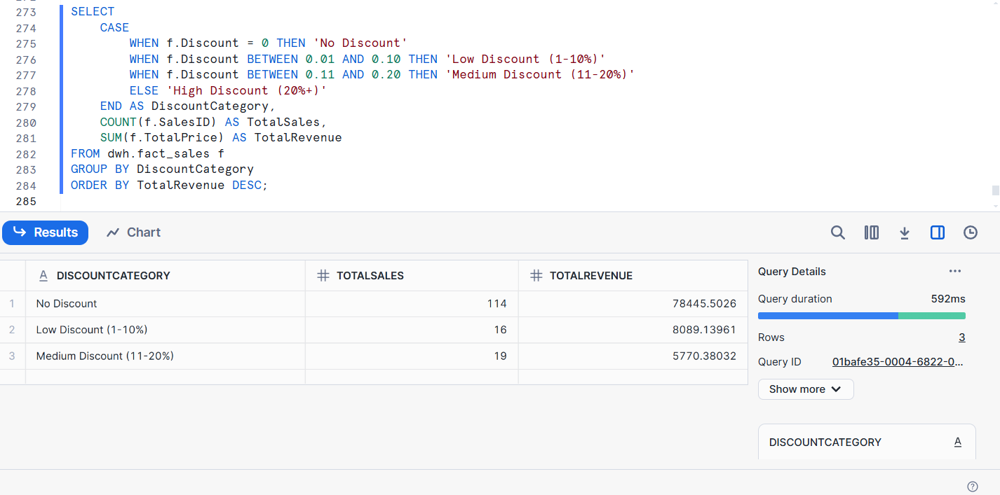
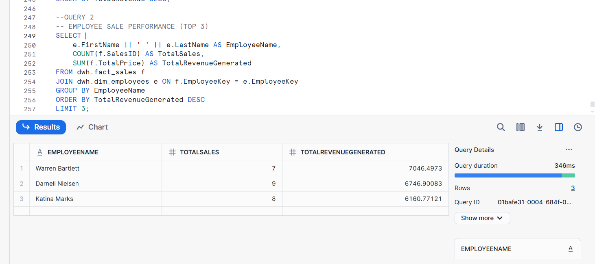
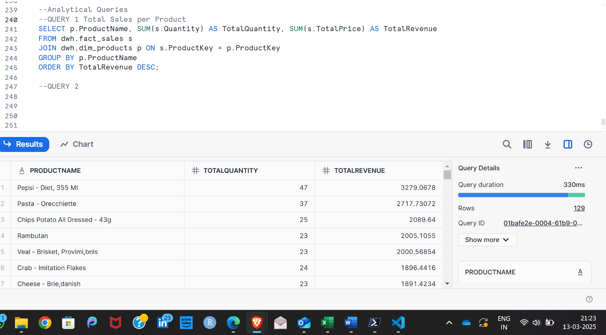

***GROCERY Sales Data Warehouse***

***Project Overview***:

This project builds a Sales Data Warehouse to efficiently store, manage, and analyze sales transactions. The ETL pipeline extracts data from raw sources, transforms it into a structured format, and loads it into a star-schema-based dimensional model. The system allows fast business insights through analytical queries.

 
***Key Features***:

Data Warehouse Implementation: Uses Snowflake to store structured data.

ETL Pipeline: Extract, Transform, Load (ETL) process to clean and format data.

Dimensional Modeling: Star schema with fact and dimension tables for optimized querying.

Analytical Insights: SQL queries to analyze sales trends, employee performance, and customer segmentation.

***Project Structure***:

Data-Warehouse-Project/

│── Code/             --This contians the script for the exectution   
│── Data/             -- Contains the datasets               
│── Screenshots/      -- Contains  the screenshots for proof of successful execution                                    
│── README.md         -- Readme file to explain the project

***Prerequisites***:

Before running this project, ensure you have the following:

Database: Snowflake 

Cloud Storage: Google Cloud Storage (GCS) (For loading raw data)

SQL Client: SnowSQL 

Data Files: CSV files for products, customers, employees, and sales

***Execution Process: Running the Sales Data Warehouse in Snowflake
Step-by-Step Guide to Execution***

This section provides a step-by-step guide to executing the project in Snowflake, ensuring smooth setup and ETL execution.

***Step 1:*** Open Snowflake and Create a New Worksheet
Login to Snowflake:

Open Snowflake Web UI.
Enter your Account Details.

Select the appropriate Role (e.g., ACCOUNTADMIN or SYSADMIN).

***Create a New SQL Worksheet:***

Click on Worksheets in the left navigation panel.
Click Create → SQL Worksheet.

***Step 2:*** Set Up the Data Warehouse

Copy and paste the following script in your Snowflake Worksheet to create the database and schemas:

***CREATE DATABASE IF NOT EXISTS datawarehouse;***
***CREATE SCHEMA IF NOT EXISTS staging;***
***CREATE SCHEMA IF NOT EXISTS dwh;***

Run the script by clicking the Run button 

***Step 3:*** Create Tables in Snowflake

Create Staging Tables:
Copy and run the following script to create tables in the staging schema

***Create Data Warehouse (DWH) Tables***

Copy and run the following script to create dimension and fact tables

***Load Data into Staging Tables:***
Use the right part sql code given in the "Code" folder rea

Ensure CSV files are stored in Google Cloud Storage (GCS).

Create Storage Integration in Snowflake:
Here use the gcs integration code from the code folder.

Create an External Stage to Connect GCS to Snowflake:
Here use the gcd staging code from the code folder.

Load Data into Staging Tables
Here use the COPY INTO code from the code folder.

***Load Data into Dimensional Tables***

Run the  INSERT INTO statements related to dwh.dim tables to move data from staging to the data warehouse.

**LINK FOR THE CODE**

***https://app.snowflake.com/qysxxbh/fh83412/wTztiSElsDr/query***

***Execute Analytical Queries***

Execute Analytical Queries at the very end of the code.

***PROOF OF EXECUTION***

***ANALYTICAL QUERIES RESULTS***:

